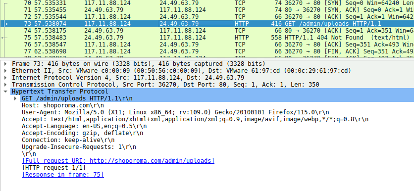
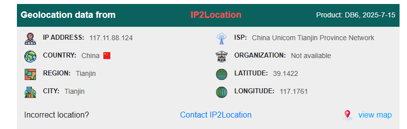
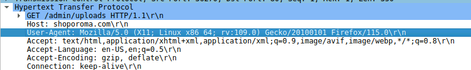
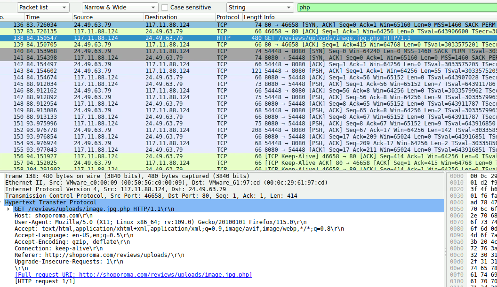
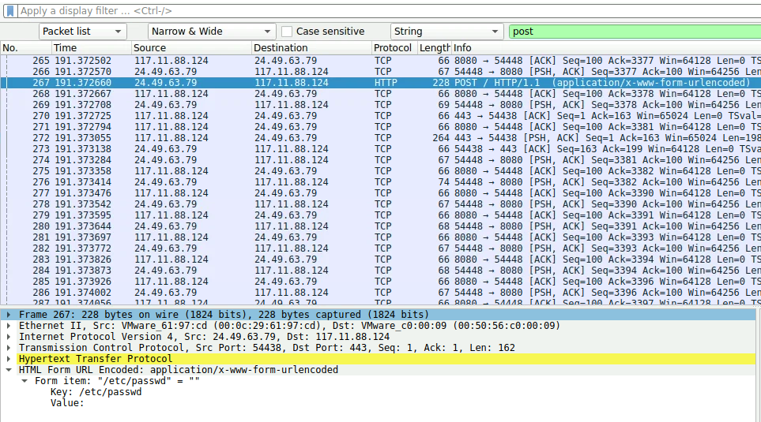
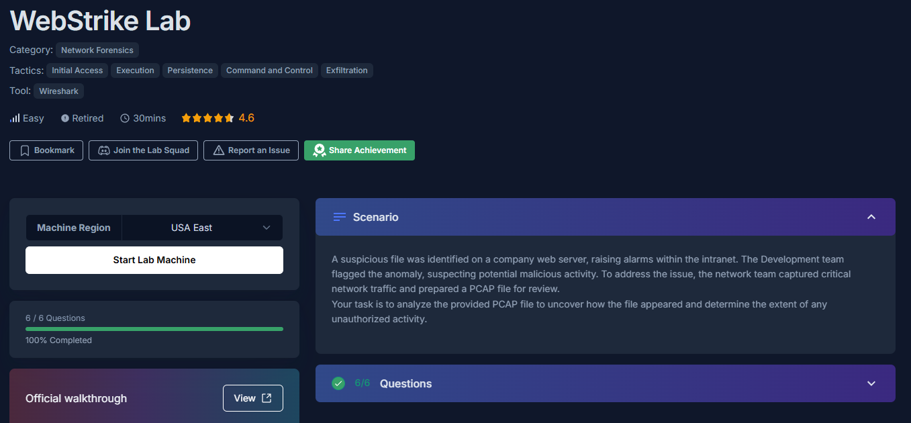

# 001 - Webstrike   

## Overview
- **Scenario:** 

   >A suspicious file was identified on a company web server, raising alarms within the intranet. The Development team flagged the anomaly, suspecting potential malicious activity. To address the issue, the network team captured critical network traffic and prepared a PCAP file for review.
   Your task is to analyze the provided PCAP file to uncover how the file appeared and determine the extent of any unauthorized activity.  
  
- **Skills Covered:** IP address lookup (Geolocation), User-Agent Identify, Exploits finding

---

## Tools Used
- Wireshark  - PCAP (Packet Capture)
 

---

## Questions
1. **Identifying the geographical origin of the attack**
   
   I saw the IP 117.11.88.124 is asking for something related to admin. I know something's off here. It's an attacker that's why I put it into IP address lookup.

   

   So it's in China.

   
    

2. **Attacker's User-Agent**

   Knowing which browser attacker is using can provide some information.

   

3. **Malicious web shell**

   >A web shell is a shell-like interface that enables a web server to be remotely accessed, often for the purposes of cyberattacks. A web shell is unique in that a web browser is used to interact with it. `Web shells are most commonly written in PHP`

   We know web shell are commonly in PHP. Use filter to find it.

   

4. **Exfiltrated file**

   We know in HTTP POST is data sending, use filter to find it.

   

---

   

---

