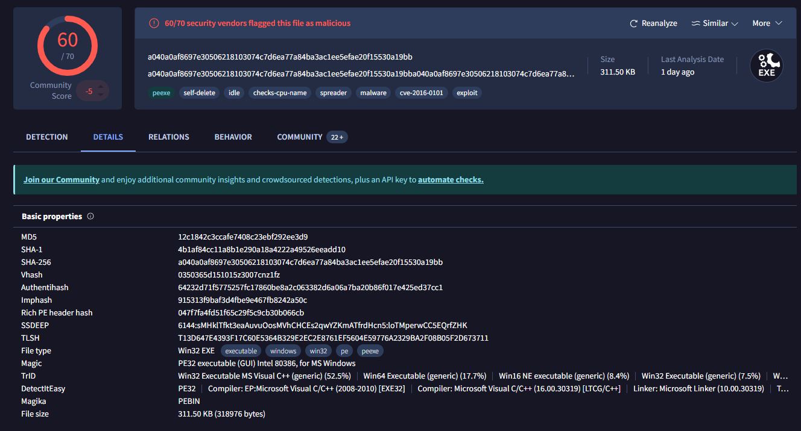
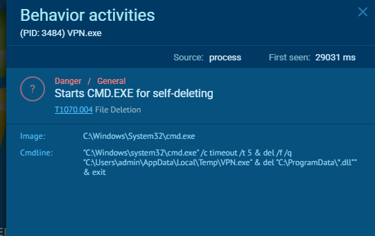
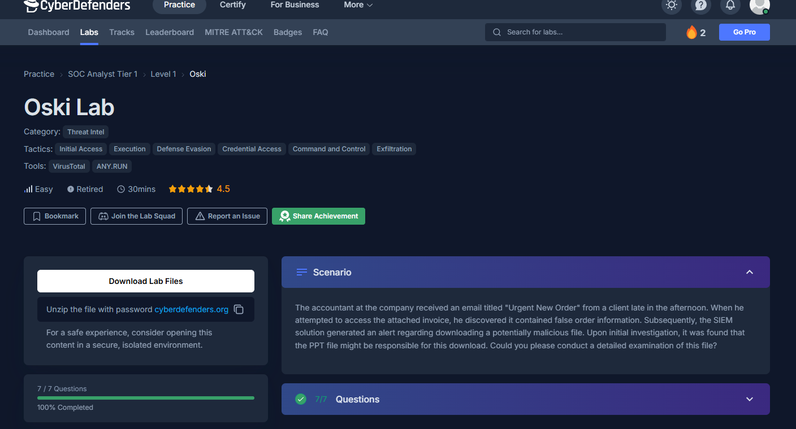

# 002 - Oski   

## Overview
- **Scenario:** 

   >The accountant at the company received an email titled "Urgent New Order" from a client late in the afternoon. When he attempted to access the attached invoice, he discovered it contained false order information. Subsequently, the SIEM solution generated an alert regarding downloading a potentially malicious file. Upon initial investigation, it was found that the PPT file might be responsible for this download. Could you please conduct a detailed examination of this file?  
  
- **Skills Covered:** VirusTotal, MITRE ATT&CK spotting, ANY.RUN reading

---

## Tools Used
- VirusTotal
- ANY.RUN - Virus report website
 

---

## Questions
1. **Identify virus by their MD5 hash**
   
   Copied the given MD5 hash to VirusTotal search bar, it showed quite a bit details

   

    You can see what it does and how it does in those Tabs
    

2. **Self-deleting**

   Seeing this log you know it deletes itself after successfully exfiltrating user's data.

   

---

   

---

